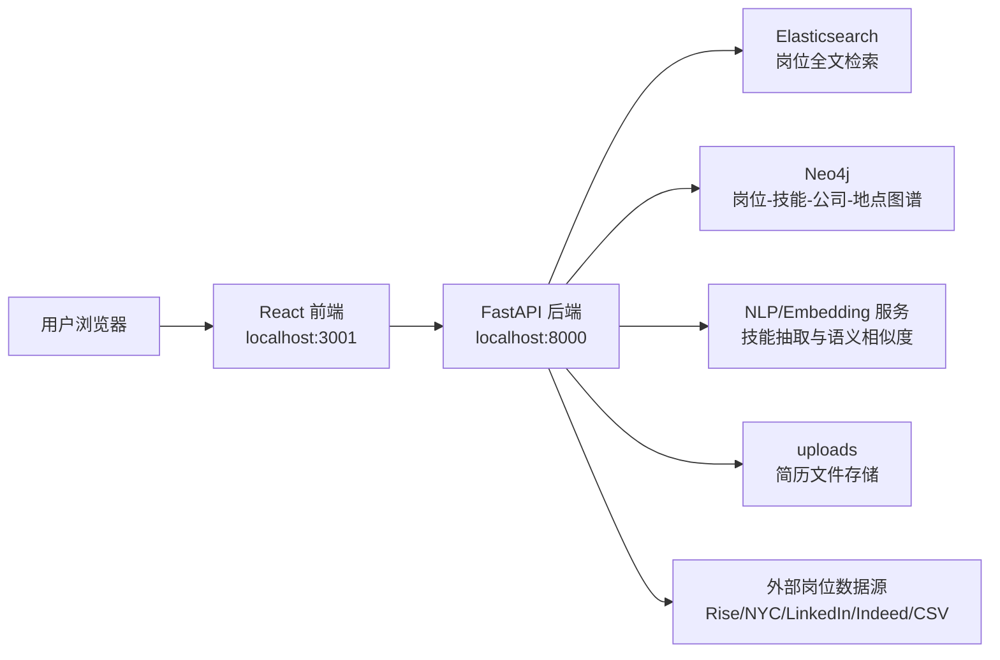

# job-hunt-AI 架构说明与赛题下一步

本文档用于快速理解本地 `job-hunt-AI` 项目如何运行、每个文件承担什么职责，以及它和赛题《多源异构数据驱动岗位和能力图谱构建与动态演化分析研究》的差距与下一步学习路线。

## 1. 项目一句话理解

`job-hunt-AI` 是一个前后端分离的 AI 岗位匹配系统。

它已经具备：

- 岗位搜索：用户输入自然语言岗位需求，系统返回岗位列表。
- 简历解析：用户上传 PDF/DOCX 简历，系统提取候选人技能、经历等信息。
- 人岗匹配：将候选人画像与岗位要求做匹配，输出匹配分数、缺失技能等。
- 知识图谱：用 Neo4j 表达岗位、技能、公司、地点、候选人之间的关系。
- 检索增强：用 Elasticsearch 做岗位全文检索，用规则、语义相似度、知识图谱特征做混合排序。

它和赛题目标很接近，但目前更偏“求职岗位匹配 Demo”，还不是完整的“岗位能力图谱动态演化系统”。后续要重点补齐：多源采集、岗位发现、能力变更追踪、幻觉防控、图谱可视化、指标测试。

## 2. 怎么运行

### 2.1 推荐方式：Docker Compose

在项目根目录运行：

```powershell
cd C:\Users\A\Desktop\揭榜挂帅\job-hunt-AI
docker compose up -d
```

启动后访问：

| 服务 | 地址 | 作用 |
| --- | --- | --- |
| 前端 | http://localhost:3001 | 用户界面 |
| 后端 API | http://localhost:8000 | FastAPI 服务 |
| Swagger 文档 | http://localhost:8000/docs | 后端接口调试 |
| Elasticsearch | http://localhost:9200 | 岗位检索引擎 |
| Neo4j Browser | http://localhost:7474 | 图数据库界面 |

Neo4j 默认账号：

```text
Username: neo4j
Password: password
```

### 2.2 Windows 安装脚本

项目提供了：

```powershell
.\install.ps1
```

脚本会检查 Docker、创建 `.env`、拉取镜像、启动服务、初始化演示数据。

### 2.3 本地开发方式

如果不用 Docker 镜像，通常是分别启动后端和前端。

后端：

```powershell
cd C:\Users\A\Desktop\揭榜挂帅\job-hunt-AI\backend-src
pip install -r requirements.txt
python -m spacy download en_core_web_sm
uvicorn app.main:app --host 0.0.0.0 --port 8000 --reload
```

前端：

```powershell
cd C:\Users\A\Desktop\揭榜挂帅\job-hunt-AI\frontend-src
npm install
npm start
```

注意：本地开发仍然需要 Elasticsearch 和 Neo4j 正常运行，否则部分接口会退化或失败。

## 3. 总体架构



### 核心数据流

1. 用户在前端搜索岗位或上传简历。
2. 前端通过 `frontend-src/src/services/api.js` 调后端 `/api/v1/...` 接口。
3. 后端 FastAPI 在 `backend-src/app/main.py` 注册各类路由。
4. 搜索请求进入 `HybridSearchService`，组合 Elasticsearch 检索、语义相似度、知识图谱特征和重排序。
5. 简历上传请求进入 `ResumeService`，提取文本、解析候选人技能与经历。
6. 岗位数据进入 Elasticsearch 做检索索引，同时进入 Neo4j 形成岗位能力图谱。
7. 前端展示岗位结果、匹配解释、推荐列表和申请弹窗。

## 4. 根目录文件说明

| 文件/目录 | 作用 |
| --- | --- |
| `.env.example` | 环境变量模板，主要包含 Anthropic API Key、Neo4j 账号密码、端口配置说明。 |
| `.gitignore` | Git 忽略规则。 |
| `docker-compose.yml` | 项目一键部署核心文件，定义 Elasticsearch、Neo4j、backend、frontend 四个服务。 |
| `install.ps1` | Windows 一键安装脚本。 |
| `install.sh` | Linux/macOS 一键安装脚本。 |
| `uninstall.ps1` | Windows 卸载/清理脚本。 |
| `uninstall.sh` | Linux/macOS 卸载/清理脚本。 |
| `README.md` | 项目总说明，包含功能介绍、部署方式、访问地址和截图说明。 |
| `QUICK_START.md` | 快速使用指南，包含搜索、上传简历、Neo4j 查询、API 使用示例。 |
| `LICENSE` | 开源许可证。 |
| `backend-src/` | FastAPI 后端源码。 |
| `frontend-src/` | React 前端源码。 |
| `images/` | README 展示用截图和流程图。 |
| `jobs/` | 本地岗位数据样例，目前有 `SDE-Nov21.csv`。 |
| `markdown/` | 项目说明文档目录，本文件也放在这里。 |
| `uploads/` | 用户上传的简历文件保存目录。 |

## 5. Docker 服务说明

`docker-compose.yml` 定义了四个容器：

| 服务 | 镜像 | 端口 | 作用 |
| --- | --- | --- | --- |
| `elasticsearch` | `docker.elastic.co/elasticsearch/elasticsearch:8.11.0` | `9200` | 存储岗位索引，支持关键词和全文检索。 |
| `neo4j` | `neo4j:5.14-community` | `7474`, `7687` | 存储岗位、技能、公司、地点、候选人关系。 |
| `backend` | `mvyas7/job-hunt-ai-backend:v1.2.0` | `8000` | FastAPI 后端，承接所有业务逻辑。 |
| `frontend` | `mvyas7/job-hunt-ai-frontend:v1.3.1` | `3001:3000` | React 前端界面。 |

注意：当前 Compose 用的是 Docker Hub 预构建镜像，不一定会自动使用你本地 `backend-src` 和 `frontend-src` 的代码。如果你修改本地源码并希望容器生效，需要改 Compose 为 `build:` 或本地启动开发服务。

## 6. 后端结构说明

### 6.1 后端入口

| 文件 | 作用 |
| --- | --- |
| `backend-src/app/main.py` | FastAPI 应用入口。创建 app、配置 CORS、注册路由、提供 `/health` 和首页说明、启动时检查 Elasticsearch/Neo4j 连接。 |
| `backend-src/app/core/config.py` | 用 Pydantic Settings 管理配置，读取项目根目录 `.env`。 |
| `backend-src/app/core/database.py` | 创建 Elasticsearch 和 Neo4j 客户端，提供 `get_elasticsearch()`、`get_neo4j()`。 |

### 6.2 API 路由层

| 文件 | 主要接口 | 作用 |
| --- | --- | --- |
| `backend-src/app/api/jobs.py` | `/api/v1/jobs/...` | 岗位搜索、按 ID 查询岗位、相似岗位、创建/更新/删除岗位、批量导入、简历上传、岗位推荐、市场趋势。 |
| `backend-src/app/api/job_ingestion.py` | `/api/v1/ingestion/...` | 从外部岗位源抓取岗位、后台抓取、批量抓取、查看数据源、去重。 |
| `backend-src/app/api/endpoints/data_ingestion.py` | `/api/v1/ingest/...` | Rise API 岗位导入、批量导入、导入状态、清空数据。 |
| `backend-src/app/api/endpoints/csv_ingestion.py` | `/api/v1/csv/...` | CSV 岗位导入，包含通用 CSV 和项目里的 SWE CSV 处理逻辑。 |
| `backend-src/app/api/endpoints/reranking.py` | `/api/v1/reranking/...` | 搜索后重排序、基于简历重排序、个性化推荐、解释、权重更新、关键词重排。 |
| `backend-src/app/api/endpoints/auth.py` | `/api/v1/auth/...` | 用户注册、登录、当前用户信息、投递岗位、查看投递记录。 |
| `backend-src/app/api/endpoints/keyword_extraction.py` | `/api/v1/keyword-extraction/extract` | 从搜索语句中抽取岗位、技能、地点、薪资等关键词。 |

### 6.3 数据模型层

| 文件 | 作用 |
| --- | --- |
| `backend-src/app/models/job.py` | 定义 `Job`、`JobSearchQuery`、`JobSearchResult`、`Location`、`Salary`、`Benefit` 等岗位检索核心结构。 |
| `backend-src/app/models/candidate.py` | 定义候选人、技能、经历、教育、简历解析结果和人岗匹配结果。 |
| `backend-src/app/models/knowledge_graph.py` | 定义图谱节点、关系、查询、实体抽取、语义增强等结构。 |
| `backend-src/app/models/reranking.py` | 定义重排序请求、响应、评分因子、解释、权重更新结构。 |
| `backend-src/app/models/user.py` | 定义用户注册、登录、用户资料、Token、投递记录结构。 |

### 6.4 服务层

| 文件 | 作用 |
| --- | --- |
| `backend-src/app/services/elasticsearch_service.py` | 创建岗位索引、写入岗位、批量写入、构造搜索 query、查询岗位和相似岗位。 |
| `backend-src/app/services/knowledge_graph_service.py` | 创建 Job/Candidate/Company/Location/Skill 节点和关系，计算技能路径、相关技能、人岗图谱匹配。 |
| `backend-src/app/services/hybrid_search_service.py` | 项目搜索主引擎。融合 Elasticsearch、语义相似度、知识图谱、候选人画像，输出最终岗位排序和解释。 |
| `backend-src/app/services/resume_service.py` | 保存上传文件，解析 PDF/DOCX/TXT，生成候选人画像，输出简历洞察和改进建议。 |
| `backend-src/app/services/nlp_service.py` | 技能抽取、岗位要求抽取、硬约束抽取、候选人画像抽取、Embedding 和语义相似度计算。 |
| `backend-src/app/services/reranking_service.py` | 对检索结果做二次排序，按技能、经验、地点、薪资、语义相似度、公司偏好等因素评分。 |
| `backend-src/app/services/ai_scoring_service.py` | 如果配置 Anthropic API Key，用大模型生成更细的人岗匹配评分与解释；否则走默认/规则方案。 |
| `backend-src/app/services/keyword_extraction_service.py` | 从自然语言查询中提取岗位名称、技能、地点、薪资等关键词。 |
| `backend-src/app/services/feature_engineering_service.py` | 为岗位构造排序特征，包括词法、语义和知识图谱特征。 |
| `backend-src/app/services/candidate_generation_service.py` | 从词法检索、语义检索、图谱检索中生成候选岗位集合。 |
| `backend-src/app/services/semantic_ann_service.py` | 加载本地 ANN 向量索引，用于快速语义召回。 |
| `backend-src/app/services/data_ingestion_service.py` | 岗位导入流水线：抓取、NLP 处理、写入 Elasticsearch、写入 Neo4j。 |
| `backend-src/app/services/rise_api_service.py` | 调 Rise API 抓岗位，并映射成项目内部 `Job` 模型。 |
| `backend-src/app/services/nyc_jobs_adapter.py` | 调 NYC Jobs API，并映射成项目内部 `Job` 模型。 |
| `backend-src/app/services/job_scraper_service.py` | LinkedIn/Indeed 等外部数据源适配器与统一抓取服务。 |
| `backend-src/app/services/scheduler_service.py` | 定时抓取岗位数据的调度器。 |
| `backend-src/app/services/auth_service.py` | 密码哈希、JWT token、注册登录、当前用户解析。 |

### 6.5 数据初始化

| 文件 | 作用 |
| --- | --- |
| `backend-src/setup_databases.py` | 初始化 Elasticsearch 和 Neo4j，并创建示例岗位数据。适合第一次跑通系统时使用。 |
| `backend-src/requirements.txt` | Python 后端依赖，包括 FastAPI、Elasticsearch、Neo4j、spaCy、sentence-transformers、LightGBM、PyPDF2、python-docx 等。 |
| `backend-src/Dockerfile` | 后端开发镜像构建文件。 |
| `backend-src/Dockerfile.prod` | 后端生产镜像构建文件。 |

## 7. 前端结构说明

### 7.1 前端入口

| 文件 | 作用 |
| --- | --- |
| `frontend-src/package.json` | React 项目依赖与脚本。核心依赖包括 React、React Router、Ant Design、Axios、React Query、Recharts。 |
| `frontend-src/public/index.html` | React 应用挂载的 HTML 模板。 |
| `frontend-src/src/index.js` | React 入口，把 `App` 挂载到页面。 |
| `frontend-src/src/App.js` | 前端路由总入口，注册首页、搜索页、岗位详情页、简历上传页、推荐页、登录注册页。 |
| `frontend-src/src/App.css` | 全局应用样式。 |
| `frontend-src/src/index.css` | 基础 CSS。 |

### 7.2 前端页面

| 文件 | 作用 |
| --- | --- |
| `frontend-src/src/pages/HomePage.js` | 首页，展示平台入口、搜索引导和核心卖点。 |
| `frontend-src/src/pages/SearchPage.js` | 搜索主页面，包含筛选、关键词抽取、重排序和结果列表。 |
| `frontend-src/src/pages/SearchPage.css` | 搜索页样式。 |
| `frontend-src/src/pages/JobDetailsPage.js` | 岗位详情页，展示单个岗位信息和相似岗位。 |
| `frontend-src/src/pages/ResumeUploadPage.js` | 简历上传页面，调用后端解析简历。 |
| `frontend-src/src/pages/RecommendationsPage.js` | 基于候选人信息的推荐页面。 |
| `frontend-src/src/pages/PersonalizedRecommendationsPage.js` | 基于简历和用户描述的个性化推荐页面。 |
| `frontend-src/src/pages/LoginPage.js` | 登录页。 |
| `frontend-src/src/pages/RegisterPage.js` | 注册页。 |

### 7.3 前端组件与状态

| 文件 | 作用 |
| --- | --- |
| `frontend-src/src/components/Header.js` | 顶部导航栏。 |
| `frontend-src/src/components/JobApplicationModal.js` | 岗位申请弹窗。 |
| `frontend-src/src/components/RerankingScore.js` | 展示重排序分数、评分因子和解释。 |
| `frontend-src/src/contexts/AuthContext.js` | 前端用户登录状态管理。 |
| `frontend-src/src/contexts/CandidateContext.js` | 候选人/简历信息状态管理。 |
| `frontend-src/src/services/api.js` | 前端所有 API 调用集中封装。后端不可用时，部分搜索接口会回退到 mock 数据。 |
| `frontend-src/src/data/mockJobData.js` | 前端 mock 岗位数据，用于后端不可用时演示搜索结果。 |

### 7.4 前端部署文件

| 文件 | 作用 |
| --- | --- |
| `frontend-src/Dockerfile` | 前端开发镜像。 |
| `frontend-src/Dockerfile.prod` | 前端生产镜像。 |
| `frontend-src/nginx.conf` | 生产模式下 Nginx 配置。 |
| `frontend-src/docker-entrypoint.sh` | 容器入口脚本。 |

## 8. 当前项目已经覆盖的赛题要求

赛题要求的核心链路是：

```text
多源数据采集 -> 新岗位发现/既有岗位更新 -> 能力图谱动态演化 -> 简历解析 -> 人岗匹配与差距分析 -> 学习路径建议
```

当前项目已有基础：

| 赛题能力 | 当前项目状态 | 相关代码 |
| --- | --- | --- |
| 岗位数据导入 | 已有 CSV、Rise、NYC、LinkedIn/Indeed 适配雏形 | `data_ingestion_service.py`, `csv_ingestion.py`, `rise_api_service.py`, `nyc_jobs_adapter.py`, `job_scraper_service.py` |
| JD 解析 | 有 NLP 技能抽取、岗位要求抽取 | `nlp_service.py`, `csv_ingestion.py` |
| 简历解析 | 已支持 PDF/DOCX/TXT，能提取技能、经历、教育 | `resume_service.py`, `nlp_service.py` |
| 人岗匹配 | 已有技能、经验、地点、薪资、签证等匹配 | `hybrid_search_service.py`, `reranking_service.py` |
| 知识图谱 | 已有 Job/Skill/Company/Location/Candidate 图谱 | `knowledge_graph_service.py`, `knowledge_graph.py` |
| 语义搜索 | 已有 Elasticsearch + Embedding + 图谱特征混合搜索 | `hybrid_search_service.py`, `elasticsearch_service.py`, `semantic_ann_service.py` |
| 解释性 | 有重排序解释和 AI 评分解释 | `reranking_service.py`, `ai_scoring_service.py` |

## 9. 当前项目距离赛题还缺什么

### 9.1 新岗位发现还不完整

赛题要求：识别市场上正在萌芽但尚未标准化的新岗位，并生成岗位定义。

当前项目更多是“已有岗位检索与推荐”，没有完整的新岗位发现模块。

应补：

- 按时间窗口统计新出现的岗位名称、技能组合、职责表达。
- 对岗位 title 和 JD 做聚类，发现新兴岗位簇。
- 用 LLM 总结岗位定义：岗位名称、核心职责、必备技能、加分技能、行业场景。
- 给出数据证据：来自哪些 JD、出现频次、增长率、代表公司、代表技能。

### 9.2 既有岗位能力动态更新还不完整

赛题要求：对 Java 开发工程师等既有岗位，识别新增、删除、修改的能力项。

当前项目没有明显的版本化能力图谱。

应补：

- 为每个岗位保存 `time_window` 或 `snapshot_version`。
- 统计每个时间段的技能频次、TF-IDF、共现关系。
- 做技能变化 diff：
  - 新增技能
  - 删除技能
  - 热度上升技能
  - 热度下降技能
  - 表述变化技能
- 在 Neo4j 中加 `SkillSnapshot`、`JobSnapshot` 或关系属性 `valid_from`、`valid_to`。

### 9.3 多源异构交叉验证还不完整

赛题强调招聘数据有时滞、噪声、抄袭、通胀。

当前项目有多源入口，但还没有严格的可信度模型。

应补：

- 数据源可信权重：官方招聘页 > 主流招聘平台 > 第三方搬运 > 用户提交。
- JD 去重和抄袭检测：SimHash/MinHash/Embedding 相似度。
- 技能可信度：至少 N 个独立来源同时出现才进入图谱。
- 时间衰减：越新的 JD 权重越高。
- 异常检测：过长技能列表、无上下文技能堆砌、明显模板化 JD 降权。

### 9.4 幻觉防控还不完整

赛题明确要求“能力幻觉防控”。

当前 `ai_scoring_service.py` 能用大模型解释，但还需要让大模型输出必须绑定证据。

应补：

- RAG 证据约束：每个生成结论都要引用原始 JD 片段或统计结果。
- 结构化输出校验：LLM 输出必须符合 JSON Schema。
- 能力项白名单/同义词表：技能必须归一到标准技能库。
- 低证据标记：证据不足时输出“待人工确认”，不能直接进入正式图谱。
- 人工审核流：新岗位定义和能力变更先进入草稿态。

### 9.5 图谱可视化还不够

赛题要求“新一代信息技术岗位全景图谱”，可以按技术栈和级别切换视图。

当前 Neo4j Browser 可看图，但前端没有完整业务化图谱视图。

应补：

- 前端新增 `KnowledgeGraphPage`。
- 展示岗位 -> 技能 -> 技术栈 -> 行业场景。
- 支持筛选：AI、大数据、物联网、智能系统；初级/中级/高级。
- 展示技能热度、增长率、关系强度。
- 点击岗位后展示岗位定义、能力项、变化历史。

### 9.6 测试指标还不完整

赛题硬指标：

- 至少 100 条岗位 JD 和测试用例。
- JD 解析准确率 >= 90%。
- 简历提取准确率 >= 90%。
- 匹配准确率 >= 90%。
- 单元测试覆盖率 >= 60%。

当前项目没有看到完整测试目录和指标评测脚本。

应补：

- `tests/` 单元测试。
- `evaluation/` 指标评估脚本。
- `data/gold/` 人工标注的 JD/简历/匹配标准答案。
- 输出可复现实验报告。

## 10. 建议下一步知识路线

### 第一阶段：先跑通和读懂现有项目

目标：你能说清楚“搜索一次岗位时，数据怎么流动”。

重点学：

1. FastAPI 路由和 Pydantic 模型。
2. React 页面如何调用 API。
3. Elasticsearch 的 index、mapping、query。
4. Neo4j 的节点、关系、Cypher 查询。

建议按这个顺序读代码：

```text
frontend-src/src/pages/SearchPage.js
frontend-src/src/services/api.js
backend-src/app/main.py
backend-src/app/api/jobs.py
backend-src/app/services/hybrid_search_service.py
backend-src/app/services/elasticsearch_service.py
backend-src/app/services/knowledge_graph_service.py
```

### 第二阶段：把赛题变成项目模块

目标：从“求职推荐系统”升级成“岗位能力图谱动态演化系统”。

建议新增模块：

| 模块 | 建议文件 | 作用 |
| --- | --- | --- |
| 新岗位发现 | `backend-src/app/services/emerging_job_service.py` | 聚类 JD，发现新岗位簇，生成岗位定义。 |
| 能力演化分析 | `backend-src/app/services/skill_evolution_service.py` | 对比不同时间窗口，输出技能新增/删除/修改。 |
| 数据可信度 | `backend-src/app/services/source_validation_service.py` | 多源交叉验证、去重、时效权重、噪声降权。 |
| 幻觉防控 | `backend-src/app/services/evidence_guard_service.py` | 约束 LLM 输出必须带证据和可信度。 |
| 图谱可视化接口 | `backend-src/app/api/endpoints/graph.py` | 给前端返回图谱节点、边、热度、演化历史。 |
| 指标评测 | `backend-src/evaluation/` | 计算 JD 解析、简历解析、人岗匹配准确率。 |

### 第三阶段：做一个最小可参赛闭环

不要一上来追求大而全，先做一个“可演示闭环”：

1. 准备 100 条 AI/大数据/物联网/智能系统岗位 JD。
2. 导入系统，抽取岗位、技能、职责、行业场景。
3. 选择 1 个新岗位，例如“AI Agent 工程师”或“多模态算法工程师”。
4. 选择 1 个既有岗位，例如“Java 开发工程师”。
5. 对这两个岗位构建技能级能力图谱。
6. 展示一个时间演化：例如 2023 -> 2024 -> 2025 -> 2026 技能变化。
7. 上传简历，输出差距分析和学习路径。
8. 用测试集证明三项准确率接近或超过 90%。

## 11. 最适合先改的功能点

建议你下一步先做“能力演化分析”，因为它最贴合赛题，也能复用现有项目。

### 目标功能

输入：

```json
{
  "job_title": "Java Developer",
  "old_window": "2023",
  "new_window": "2026"
}
```

输出：

```json
{
  "job_title": "Java Developer",
  "added_skills": ["Spring Cloud", "Kubernetes", "LLM API Integration"],
  "removed_skills": ["Struts"],
  "rising_skills": ["Cloud Native", "Microservices"],
  "declining_skills": ["JSP"],
  "evidence": [
    {
      "skill": "Kubernetes",
      "old_frequency": 0.12,
      "new_frequency": 0.46,
      "source_count": 18
    }
  ]
}
```

### 为什么先做这个

- 赛题明确要求“既有岗位能力动态更新”。
- 现有项目已经有岗位模型、技能抽取、Elasticsearch、Neo4j。
- 很容易做成演示：一张图展示某岗位技能新增/删除/升温。
- 能自然引出“数据源证据”和“幻觉防控”。

## 12. 你需要掌握的关键概念

| 概念 | 在本项目里的对应 |
| --- | --- |
| JD 解析 | 从岗位描述中抽取岗位名称、职责、技能、经验、学历、行业场景。 |
| 简历解析 | 从 PDF/DOCX 中抽取候选人技能、工作经历、教育背景。 |
| 语义检索 | 不只匹配关键词，而是用 embedding 匹配语义相近岗位。 |
| 混合检索 | 关键词检索 + 语义检索 + 图谱关系 + 规则过滤。 |
| 知识图谱 | 用节点和关系表达岗位、技能、公司、地点、候选人。 |
| 重排序 | 初步检索后，再按人岗匹配因素重新排序。 |
| 能力演化 | 对比不同时期同一岗位的技能要求变化。 |
| 多源交叉验证 | 同一结论需要多个独立数据源支持，降低噪声和抄袭影响。 |
| 幻觉防控 | 生成式模型不能凭空编技能，必须有证据、置信度和校验。 |

## 13. 赛题交付物清单

最终参赛至少要准备：

| 交付物 | 建议内容 |
| --- | --- |
| 作品设计实现方案 | 系统架构、算法流程、数据源、图谱构建、幻觉防控、评测方案。 |
| PPT | 10-15 页，突出问题、方案、创新、演示、指标。 |
| 演示视频 | 10 分钟以内，必须展示新岗位发现、既有岗位能力更新、图谱、人岗匹配。 |
| 源代码 | 当前项目源码加新增模块。 |
| 部署说明 | Docker Compose 启动方式、环境变量、端口说明。 |
| 测试数据 | 至少 100 条岗位 JD 和测试用例。 |
| 图谱样例 | 1 个新岗位 + 1 个既有岗位的能力图谱和数据源证据。 |
| 指标报告 | JD 解析准确率、简历提取准确率、匹配准确率、测试覆盖率。 |

## 14. 当前项目最重要的改造方向

一句话：把“岗位搜索推荐系统”改造成“岗位能力图谱动态演化系统”。

优先级建议：

1. 新增 `SkillEvolutionService`：做既有岗位能力变化分析。
2. 新增 `EmergingJobService`：做新岗位发现和岗位定义生成。
3. 新增证据表和可信度字段：每个能力项都能追溯来源。
4. 新增前端图谱页面：可视化岗位、技能、技术栈、层级和演化。
5. 新增评测脚本：用 100 条 JD 和简历样例计算准确率。

