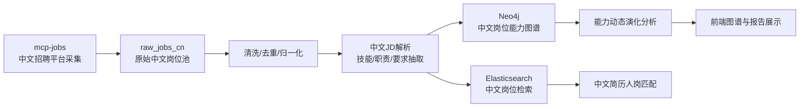

# 中文岗位数据源替换与赛题数据方案

本文档回答三个问题：

1. 现在要把 `job-hunt-AI` 的外国岗位数据换成本地中文数据，究竟需要哪些数据。
2. 数据应该怎么搜集、清洗、标注和进入系统。
3. [`mergedao/mcp-jobs`](https://github.com/mergedao/mcp-jobs) 这个 GitHub 项目有什么用，怎么放进当前赛题方案里。

本文档主要围绕赛题《多源异构数据驱动岗位和能力图谱构建与动态演化分析研究》的要求设计。

## 1. 赛题真正需要的数据

这个赛题不是简单做“岗位搜索”，而是做“岗位能力图谱构建与动态演化分析”。所以数据不能只收集岗位标题和薪资，必须收集到能支撑图谱、演化、匹配、验证的结构化字段。

### 1.1 核心岗位 JD 数据

每条岗位 JD 建议至少包含：

| 字段 | 示例 | 用途 |
| --- | --- | --- |
| `source` | Boss直聘、猎聘、智联招聘、51job、拉勾、企业官网 | 多源交叉验证、可信度计算 |
| `source_url` | 原始岗位链接 | 证据追溯、幻觉防控 |
| `crawl_time` | 2026-06-11 14:00:00 | 动态演化分析 |
| `publish_time` | 2026-06-08 | 判断岗位时效 |
| `job_title` | AI Agent 工程师 | 新岗位发现、岗位聚类 |
| `company_name` | 某科技公司 | 行业/企业分布分析 |
| `industry` | 人工智能、互联网、智能制造、金融科技 | 行业场景图谱 |
| `city` | 合肥、上海、北京、深圳 | 区域岗位分析 |
| `salary` | 20-35K | 市场价值分析 |
| `experience_required` | 3-5年 | 人岗匹配 |
| `education_required` | 本科 | 人岗匹配 |
| `job_description` | 岗位职责原文 | JD 解析、职责抽取 |
| `requirements_text` | 任职要求原文 | 技能抽取、能力项识别 |
| `benefits` | 五险一金、年终奖 | 辅助匹配 |
| `tags` | Python、LLM、RAG、Agent | 技能候选项 |
| `raw_html_or_text` | 原始页面文本 | 复核、审计、错误回溯 |

赛题要求至少 100 条岗位 JD 和测试用例。建议不要只做 100 条，研发阶段至少收集 1000-3000 条，最后人工标注其中 100-300 条作为评测集。

### 1.2 能力图谱数据

岗位 JD 进入系统后，要抽取成能力图谱字段：

| 字段 | 示例 | 用途 |
| --- | --- | --- |
| `skill_name` | RAG、LangChain、Spring Cloud、Kubernetes | 技能点节点 |
| `skill_type` | 编程语言、框架、算法、工具、业务能力、软技能 | 技能分类 |
| `skill_level` | 了解、熟悉、掌握、精通 | 技能层级 |
| `evidence_text` | 原 JD 中支持该技能的句子 | 幻觉防控 |
| `evidence_source_url` | 原岗位链接 | 可追溯 |
| `confidence` | 0.86 | 抽取可信度 |
| `frequency` | 某岗位簇中出现比例 | 热度分析 |
| `first_seen_at` | 首次出现时间 | 新技能识别 |
| `last_seen_at` | 最近出现时间 | 技能衰退识别 |

能力图谱不是“技能列表”，而是“岗位-技能-技术栈-行业场景-时间”的关系网络。

### 1.3 新岗位发现数据

赛题要求识别“市场上正在萌芽但尚未标准化或逐渐兴起的新岗位”。

所以要额外保存：

| 字段 | 用途 |
| --- | --- |
| `normalized_title` | 归一化岗位名称，例如“AI Agent工程师”“Agent应用开发工程师”归为同类 |
| `title_embedding` | 岗位标题向量，用于聚类 |
| `jd_embedding` | JD 文本向量，用于发现相似岗位簇 |
| `skill_signature` | 岗位技能组合，例如 LLM + RAG + Function Calling + Python |
| `growth_rate` | 某岗位簇在不同时间窗口的增长率 |
| `representative_jds` | 代表性 JD 样本 |
| `generated_definition` | 大模型生成的新岗位定义 |
| `human_review_status` | 待审核、已确认、已驳回 |

### 1.4 既有岗位能力动态更新数据

赛题举例说“如 Java 开发工程师”，要求识别能力要求变化。

所以必须有时间维度：

| 字段 | 示例 | 用途 |
| --- | --- | --- |
| `job_family` | Java开发工程师 | 对同类岗位做聚合 |
| `time_window` | 2024Q1、2025Q1、2026Q1 | 时间切片 |
| `skill_name` | Spring Cloud、Kubernetes、JSP | 能力项 |
| `old_frequency` | 0.12 | 旧时间窗口出现比例 |
| `new_frequency` | 0.46 | 新时间窗口出现比例 |
| `change_type` | 新增、删除、增强、减弱、表述变化 | 能力演化结论 |
| `evidence_count` | 18 | 证据数量 |
| `source_diversity` | 4个平台 | 多源交叉验证 |

### 1.5 简历数据与标注数据

赛题要求简历提取准确率 >= 90%，所以需要测试简历。

建议准备：

| 数据 | 数量建议 | 用途 |
| --- | --- | --- |
| 中文 PDF 简历 | 30-50 份 | 测试 PDF 解析 |
| Word 简历 | 30-50 份 | 测试 DOCX 解析 |
| 人工标注技能 | 每份简历一份标准答案 | 计算技能抽取准确率 |
| 人工标注经历 | 公司、职位、时间、项目 | 计算经历解析准确率 |
| 目标岗位匹配标签 | 适合/一般/不适合，或 0-100 分 | 计算匹配准确率 |

注意：简历涉及个人隐私，参赛建议使用匿名化样例、合成简历或团队成员授权简历，删除姓名、电话、邮箱、学校编号等敏感信息。

## 2. 中文数据源怎么搜集

### 2.1 推荐数据源组合

赛题强调“多源异构数据”，所以不能只用一个招聘网站。

建议组合：

| 类型 | 数据源 | 价值 |
| --- | --- | --- |
| 招聘平台 | Boss直聘、猎聘、智联招聘、前程无忧、拉勾 | 真实市场岗位需求 |
| 企业官网 | 科大讯飞、华为、阿里、腾讯、百度、字节、海康、大疆等招聘页 | 可信度高，适合作证据源 |
| 政府/公共数据 | 人社部新职业、国家职业分类大典、地方人才政策 | 标准岗位名称和职业定义 |
| 行业报告 | 艾瑞、赛迪、信通院、工信部、招聘平台年度报告 | 趋势解释和行业背景 |
| 开源社区 | GitHub、Gitee、MCP/Agent/RAG 项目生态 | 新技术热度辅助证据 |
| 课程平台 | 慕课、学堂在线、B站课程、培训机构课程大纲 | 学习路径规划 |

### 2.2 采集关键词建议

围绕赛题要求的“新一代信息技术领域”，建议先限定 4 个方向：

| 方向 | 搜索关键词 |
| --- | --- |
| 人工智能 | AI工程师、机器学习工程师、深度学习工程师、NLP算法工程师、计算机视觉工程师、多模态算法工程师、AI Agent工程师、RAG工程师、大模型应用开发、提示词工程师 |
| 大数据 | 大数据开发工程师、数据仓库工程师、数据治理工程师、数据分析师、实时计算工程师、Flink工程师、数据湖工程师 |
| 智能系统 | 智能制造工程师、智能驾驶算法工程师、机器人算法工程师、边缘计算工程师、嵌入式AI工程师 |
| 物联网 | 物联网工程师、IoT平台开发、嵌入式开发、传感器算法、工业互联网工程师 |

### 2.3 采集策略

建议先做“可控小闭环”，不要一开始全网乱抓。

第一批数据：

- 4 个技术方向。
- 每个方向 5-8 个关键词。
- 每个关键词选 3-5 个城市：合肥、北京、上海、深圳、杭州。
- 每个关键词每个平台抓 1-3 页。
- 目标得到 1000 条左右中文 JD。

第二批数据：

- 选择 1 个新岗位：例如“AI Agent 工程师”。
- 选择 1 个既有岗位：例如“Java 开发工程师”。
- 针对这两个岗位补充更多 JD，并按时间保存。
- 做图谱演示和能力演化演示。

### 2.4 合规建议

招聘平台数据采集要注意：

- 遵守平台 robots、用户协议和访问频率限制。
- 不采集个人隐私，不采集求职者信息。
- 只保存岗位公开信息。
- 控制请求频率，避免对平台造成压力。
- 最终论文/答辩中说明数据仅用于科研竞赛验证。
- 对外展示时尽量脱敏公司名称或仅展示公开可引用信息。

## 3. `mergedao/mcp-jobs` 是什么

[`mergedao/mcp-jobs`](https://github.com/mergedao/mcp-jobs) 是一个基于 MCP 的中文职位聚合服务。README 中说明它支持从主流招聘网站获取职位信息，目标平台包括猎聘、Boss、智联、51job 等，并且可以通过 `npx -y mcp-jobs` 直接启动。

它的核心价值是：让大模型或支持 MCP 的客户端，用自然语言调用职位搜索工具，而不是你手写每个平台的搜索逻辑。

### 3.1 它提供什么能力

根据仓库 README 和源码，它主要提供两个 MCP 工具：

| 工具 | 作用 | 输入 |
| --- | --- | --- |
| `mcp_search_job` | 搜索职位列表 | `keyword`、`city`、`salary`、`workYear`、`page` |
| `mcp_job_detail` | 获取职位详情 | `url` |

它的搜索入口大致支持：

```json
{
  "keyword": "AI Agent 工程师",
  "city": "北京",
  "salary": "16-20万",
  "workYear": "1-3年",
  "page": 1
}
```

返回结果会包含职位列表和搜索元数据，适合接入后续清洗、入库、抽取流程。

### 3.2 它支持哪些招聘源

源码中的 `jobSearchUrls` 包含：

- Boss直聘移动站：`zhipin`
- 猎聘：`liepin`
- 拉勾：`lagou`
- 智联招聘：`zhaopin`
- 51job：`51job`

但要注意：从当前源码看，提取规则重点实现了 Boss 直聘和猎聘，其他平台出现在 URL 配置中，不代表规则已经完整稳定。后续使用时要逐个平台实测。

### 3.3 它底层怎么工作

它不是直接调用官方 API，而是：

1. 用 TypeScript/Node.js 写 MCP Server。
2. 用 Playwright 打开招聘网页。
3. 根据 CSS selector 抓取岗位卡片。
4. 提取标题、薪资、公司、地点、标签、详情链接。
5. 对详情页继续抓取岗位描述和公司描述。
6. 返回标准 JSON 给调用方。

所以它适合做“中文岗位采集适配器”，但不能直接替代你的岗位能力图谱系统。

## 4. `mcp-jobs` 对当前项目有什么用

当前 `job-hunt-AI` 的问题是：示例数据偏美国岗位，字段是英文，图谱和简历匹配也偏英文技能体系。

`mcp-jobs` 可以帮你解决第一步：获得中文招聘市场的岗位原始数据。

它在当前项目中的位置应该是：



也就是说：

- `mcp-jobs` 负责“采集岗位”。
- 当前 `job-hunt-AI` 负责“解析、检索、图谱、匹配、推荐”。
- 你需要新增的模块负责“中文清洗、中文技能词表、动态演化、证据约束”。

## 5. 中文数据进入当前项目的方案

### 5.1 新增中文原始数据表/文件

建议先不要直接写入现有 `Job` 模型，而是先保存原始数据。

建议目录：

```text
job-hunt-AI/
  data/
    raw/
      mcp_jobs/
        2026-06-11_ai_agent_beijing.json
    cleaned/
      chinese_jobs_normalized.jsonl
    gold/
      jd_100_gold.jsonl
      resume_gold.jsonl
```

原始 JSON 字段建议：

```json
{
  "source": "zhipin",
  "keyword": "AI Agent 工程师",
  "city": "北京",
  "crawl_time": "2026-06-11T14:00:00+08:00",
  "title": "AI Agent 应用开发工程师",
  "company": "某科技公司",
  "salary": "25-45K",
  "address": "北京·海淀区",
  "tags": ["Python", "大模型", "RAG", "LangChain"],
  "job_detail_url": "https://...",
  "job_description": "岗位职责和任职要求原文",
  "raw": {}
}
```

### 5.2 新增中文岗位归一化

当前项目的 `Job` 模型偏英文，例如：

- `Location.country` 默认是 `USA`
- `Salary.currency` 默认是 `USD`
- 技能抽取词表偏英文技术词

中文数据应做归一化：

| 原始字段 | 归一化结果 |
| --- | --- |
| `25-45K` | `min_salary=25000`, `max_salary=45000`, `period=monthly`, `currency=CNY` |
| `北京·海淀区` | `city=北京`, `district=海淀区`, `country=中国` |
| `3-5年` | `experience_level=mid`，同时保存 `experience_year_min=3`, `experience_year_max=5` |
| `本科` | `education_required=bachelor` |
| `大模型应用开发` | 标准岗位族：`LLM Application Engineer` 或中文标准名 |

### 5.3 新增中文技能词表

当前英文项目可以识别 Python、React、Docker 等，但中文 JD 会出现大量中文表达。

建议建设：

```text
backend-src/app/resources/chinese_skill_taxonomy.json
```

示例：

```json
{
  "大模型": ["LLM", "大语言模型", "AIGC", "生成式AI"],
  "检索增强生成": ["RAG", "知识库问答", "向量检索", "Embedding检索"],
  "智能体": ["AI Agent", "Agent", "Function Calling", "工具调用"],
  "微服务": ["Spring Cloud", "Dubbo", "分布式服务"],
  "容器化": ["Docker", "Kubernetes", "K8s", "云原生"]
}
```

这个词表非常关键，因为赛题要求图谱颗粒度到“技能点”级别。

### 5.4 新增中文 JD 解析流程

中文 JD 解析建议分三步：

1. 规则切分：
   - 岗位职责
   - 任职要求
   - 加分项
   - 公司介绍
2. 技能抽取：
   - 词表匹配
   - 中文分词/NER
   - Embedding 相似匹配
   - LLM 结构化抽取
3. 证据绑定：
   - 每个技能必须保存来自哪一句原文。
   - 没有证据的技能不能直接进入正式图谱。

输出示例：

```json
{
  "job_title": "AI Agent 应用开发工程师",
  "required_skills": [
    {
      "name": "RAG",
      "evidence": "熟悉RAG、向量数据库和知识库问答系统建设",
      "confidence": 0.93
    }
  ],
  "preferred_skills": [
    {
      "name": "LangChain",
      "evidence": "有LangChain、LlamaIndex等框架经验优先",
      "confidence": 0.91
    }
  ],
  "responsibilities": [
    "负责企业级智能体应用开发"
  ],
  "industry_scenarios": [
    "智能客服",
    "企业知识库",
    "办公自动化"
  ]
}
```

## 6. 针对赛题的完整落地方案

### 6.1 系统目标

把当前 `job-hunt-AI` 从“英文岗位搜索推荐系统”升级为：

```text
中文多源岗位数据采集
-> 中文 JD 解析
-> 新岗位发现与定义
-> 既有岗位能力动态更新
-> 岗位能力图谱
-> 中文简历解析
-> 人岗差距诊断
-> 学习路径建议
```

### 6.2 模块设计

| 模块 | 建议文件 | 说明 |
| --- | --- | --- |
| 中文岗位采集 | `backend-src/app/services/chinese_job_ingestion_service.py` | 调用 `mcp-jobs` 或读取其 JSON 输出 |
| 中文字段归一化 | `backend-src/app/services/chinese_job_normalizer.py` | 薪资、城市、学历、经验、岗位名称归一化 |
| 中文技能抽取 | `backend-src/app/services/chinese_skill_extraction_service.py` | 中文技能词表 + LLM + 证据绑定 |
| 多源验证 | `backend-src/app/services/source_validation_service.py` | 去重、时效权重、来源可信度、抄袭检测 |
| 新岗位发现 | `backend-src/app/services/emerging_job_service.py` | 聚类岗位标题/JD/技能组合，生成新岗位定义 |
| 能力演化 | `backend-src/app/services/skill_evolution_service.py` | 按时间窗口比较技能变化 |
| 幻觉防控 | `backend-src/app/services/evidence_guard_service.py` | 检查每个结论是否有原文证据 |
| 图谱 API | `backend-src/app/api/endpoints/graph.py` | 给前端返回岗位图谱、技能图谱、演化图 |
| 评测脚本 | `backend-src/evaluation/` | 计算 JD 解析、简历解析、匹配准确率 |

### 6.3 数据库设计补充

当前 Neo4j 已经有 Job、Skill、Company、Location、Candidate。

建议新增或增强：

```cypher
(:Job {id, title, normalized_title, source, source_url, crawl_time})
(:Skill {name, normalized_name, type})
(:Evidence {text, source_url, crawl_time})
(:JobFamily {name})
(:TimeWindow {name, start_date, end_date})
(:IndustryScenario {name})

(:Job)-[:BELONGS_TO]->(:JobFamily)
(:Job)-[:REQUIRES_SKILL {confidence, requirement_type}]->(:Skill)
(:Skill)-[:SUPPORTED_BY]->(:Evidence)
(:Job)-[:APPEARS_IN]->(:TimeWindow)
(:Job)-[:USED_IN]->(:IndustryScenario)
(:Skill)-[:CO_OCCURS_WITH {count, pmi}]->(:Skill)
```

### 6.4 新岗位发现算法

建议采用“规则 + 统计 + 聚类 + LLM 总结”的组合。

流程：

1. 收集最近一个时间窗口的中文 JD。
2. 对岗位标题做归一化：
   - 去掉“高级/资深/初级”
   - 去掉城市、薪资、急招等噪声
3. 对 JD 和技能组合生成 embedding。
4. 聚类得到岗位簇。
5. 找出满足以下条件的簇：
   - 标题不稳定但语义相近
   - 最近出现频次增长快
   - 技能组合明显区别于传统岗位
   - 多个平台都有出现
6. 生成岗位定义：
   - 岗位名称
   - 核心职责
   - 必备技能
   - 加分技能
   - 典型行业应用场景
   - 证据来源
7. 人工审核后进入图谱。

示例新岗位：

```text
AI Agent 应用开发工程师
```

典型技能组合：

```text
Python + 大模型API + RAG + LangChain/LlamaIndex + 向量数据库 + 工具调用 + 工作流编排
```

### 6.5 既有岗位能力动态更新算法

建议先选择：

```text
Java 开发工程师
```

因为它是成熟岗位，变化很容易展示。

流程：

1. 收集 Java 开发岗位 JD。
2. 按时间窗口切分，例如：
   - 2024Q1
   - 2025Q1
   - 2026Q1
3. 抽取每个窗口的技能频次。
4. 计算变化：
   - 新增：新窗口频次高，旧窗口几乎没有。
   - 删除：旧窗口频次高，新窗口消失。
   - 增强：频次明显上升。
   - 减弱：频次明显下降。
   - 表述变化：旧词和新词语义相近但叫法变化。
5. 输出证据。

示例输出：

```json
{
  "job_family": "Java开发工程师",
  "added_skills": ["云原生", "Kubernetes", "大模型API集成"],
  "rising_skills": ["Spring Cloud", "微服务", "分布式事务"],
  "declining_skills": ["JSP", "Struts"],
  "modified_skills": [
    {
      "from": "SSM",
      "to": "Spring Boot + Spring Cloud",
      "reason": "岗位描述从传统Web开发转向微服务架构"
    }
  ]
}
```

### 6.6 幻觉防控方案

赛题明确要求防控 AI 生成内容“幻觉”。建议你的方案里一定写清楚：

| 风险 | 防控办法 |
| --- | --- |
| LLM 编造技能 | 每个技能必须有 JD 原文证据 |
| 单个平台噪声 | 至少两个独立来源支持才进入正式图谱 |
| JD 抄袭 | 用 SimHash/Embedding 去重，相似 JD 降权 |
| 技能堆砌 | 技能必须出现在职责/要求上下文中，而不是只出现在标签 |
| 过期岗位 | 时间衰减，旧 JD 权重降低 |
| 不确定结论 | 标记为“待人工审核”，不直接进入图谱 |

## 7. `mcp-jobs` 接入方式建议

### 7.1 最快验证方式

先在终端验证：

```powershell
npx -y mcp-jobs
```

如果你用 Cursor/Claude Desktop/Cline 等支持 MCP 的客户端，可以添加：

```json
{
  "mcpServers": {
    "mcp-jobs": {
      "command": "npx",
      "args": ["-y", "mcp-jobs"]
    }
  }
}
```

然后用自然语言测试：

```text
搜索北京的 AI Agent 工程师职位
搜索上海的大模型应用开发职位，3-5年经验
获取这个岗位链接的详情
```

### 7.2 工程化接入方式

当前 `job-hunt-AI` 后端是 Python/FastAPI，而 `mcp-jobs` 是 Node/TypeScript。

建议不要直接把两套代码硬揉在一起，而是采用“数据文件中转”或“采集服务中转”。

#### 方案 A：数据文件中转

1. 单独运行 `mcp-jobs`。
2. 调用它搜索职位。
3. 把返回 JSON 保存到 `data/raw/mcp_jobs/`。
4. Python 后端读取 JSON，清洗后写入 Elasticsearch 和 Neo4j。

优点：简单、稳定、方便调试。

缺点：不是实时接口。

#### 方案 B：封装为采集微服务

1. 新建 Node 服务包装 `mcp-jobs`。
2. 提供 HTTP 接口：

```text
POST /crawl/jobs
POST /crawl/job-detail
```

3. FastAPI 调这个 Node 服务。
4. 返回数据后进入现有导入流水线。

优点：可以集成到系统。

缺点：工程量更大。

#### 方案 C：直接实现 Python 中文采集器

参考 `mcp-jobs` 的选择器和思路，自己写 Python Playwright 采集器。

优点：技术栈统一。

缺点：开发成本高，需要维护多个平台的页面规则。

当前阶段推荐：先用方案 A，把数据跑通；后面再升级方案 B。

## 8. 当前项目需要改哪些地方

### 8.1 后端模型调整

`backend-src/app/models/job.py` 需要支持中文场景：

- `country` 默认不要固定为 `USA`，中文数据用 `中国`。
- `Salary.currency` 支持 `CNY`。
- 增加 `district`、`education_required`、`experience_year_min`、`experience_year_max`。
- 增加 `source`、`source_platform`、`crawl_time`、`raw_text`。
- 增加 `evidence` 字段或关联证据表。

### 8.2 新增中文导入接口

建议新增：

```text
POST /api/v1/chinese-jobs/import-json
POST /api/v1/chinese-jobs/import-mcp-output
GET  /api/v1/chinese-jobs/ingestion-status
```

### 8.3 新增中文技能抽取

现有 `nlp_service.py` 可以保留，但要新增中文专用服务。

建议不要直接大改原文件，新增：

```text
backend-src/app/services/chinese_skill_extraction_service.py
backend-src/app/resources/chinese_skill_taxonomy.json
```

### 8.4 前端新增数据演示页面

建议新增三个页面：

| 页面 | 用途 |
| --- | --- |
| 中文岗位数据管理 | 查看采集来源、导入状态、清洗结果 |
| 岗位能力图谱 | 展示岗位-技能-技术栈-行业场景 |
| 能力演化分析 | 展示技能新增/删除/升温/降温 |

## 9. 测试与评测方案

### 9.1 JD 解析准确率

准备 100 条中文 JD 人工标注：

```json
{
  "job_id": "jd_001",
  "gold_required_skills": ["Python", "RAG", "向量数据库"],
  "gold_preferred_skills": ["LangChain"],
  "gold_responsibilities": ["企业级智能体应用开发"]
}
```

计算：

```text
Precision = 抽对的技能 / 系统抽出的技能
Recall = 抽对的技能 / 人工标注技能
F1 = 2 * P * R / (P + R)
```

### 9.2 简历提取准确率

准备中文简历和人工标注：

- 技能
- 工作经历
- 项目经历
- 教育背景

计算技能、经历、教育字段的综合 F1。

### 9.3 人岗匹配准确率

准备：

- 20 份简历。
- 50 个岗位。
- 人工标注匹配等级。

系统输出 Top-N 推荐后，计算：

- Top-5 命中率
- NDCG
- Spearman 排序相关
- 或将匹配分数分为“适合/不适合”后算准确率

## 10. 第一阶段行动清单

第一周建议只做这些：

1. 确认 `mcp-jobs` 能否稳定抓到 Boss 和猎聘数据。
2. 用 10 个关键词、3 个城市采集第一批中文 JD。
3. 保存原始 JSON，不急着入库。
4. 写中文清洗脚本，把薪资、城市、经验、学历归一化。
5. 建一个中文技能词表初版。
6. 把 100 条 JD 人工标注成 gold 数据。
7. 接入现有 Elasticsearch，先实现中文岗位搜索。

第二周再做：

1. 中文 JD 技能抽取。
2. 中文岗位能力图谱入 Neo4j。
3. 选择“AI Agent 工程师”做新岗位发现样例。
4. 选择“Java 开发工程师”做能力演化样例。

第三周做：

1. 简历解析中文优化。
2. 人岗差距诊断。
3. 学习路径推荐。
4. 图谱可视化。
5. 评测报告。

## 11. 结论

`mcp-jobs` 对你当前项目最有用的地方，是把数据源从英文/海外岗位切换到中文本地招聘市场。它适合作为“中文岗位采集器”，但不是完整答案。

真正符合赛题的方案应该是：

```text
mcp-jobs 采集中文 JD
-> 中文清洗与归一化
-> 中文技能抽取与证据绑定
-> 多源交叉验证与去重
-> 新岗位发现
-> 既有岗位能力动态更新
-> Neo4j 能力图谱
-> 简历解析与人岗差距分析
-> 指标评测与演示
```

当前最值得先做的是：采集 1000 条中文 JD，人工标注 100 条，然后实现中文 JD 解析和 Java/AI Agent 两个岗位样例图谱。这样最容易对齐赛题评分标准。

## 12. 参考资料

- `mergedao/mcp-jobs` GitHub 仓库：https://github.com/mergedao/mcp-jobs
- `mcp-jobs` README：说明该项目是基于 MCP 的多平台职位聚合服务，支持 `npx -y mcp-jobs` 启动。
- `mcp-jobs` `package.json`：项目是 Node/TypeScript，依赖 Playwright、MCP SDK、Cheerio 等。
- `mcp-jobs` `src/mcp.ts`：暴露 `mcp_search_job` 和 `mcp_job_detail` 两个 MCP 工具。
- `mcp-jobs` `src/config/urlConfig.ts`：包含 Boss、猎聘、拉勾、智联、51job 等搜索源配置。
- 本地赛题 PDF：`XH-202621_多源异构数据驱动岗位和能力图谱构建与动态演化分析研究.pdf`

